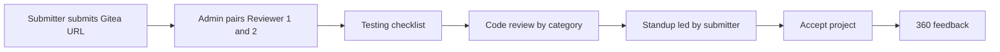

# User guide — Code review sprint

This guide explains **who does what** in the //kood code review prototype, without technical setup. If you need install or deployment steps, see **[README.md](./README.md)**.

---

## The big picture

One **submitter** builds a course project and shares a **Gitea repository link**. An **administrator** assigns **two reviewers** to that repo. Together they move through a fixed sequence:

1. **Project completion** — submitter finishes the task and hands in the repo  
2. **Testing** — reviewers check behaviour against a shared checklist  
3. **Code review** — structured observations by category (security, correctness, performance, architecture)  
4. **Standup** — short meeting: schedule, notes, and thread  
5. **Accept project** — submitter accepts the outcome of the review  
6. **360° feedback** — everyone rates and comments on the process  

The admin can watch progress, read conversation threads, run optional AI summaries, and reset a cycle if needed.

---

## Journey 1 — Administrator

**You are:** the person who runs the review programme (course staff or ops).

**Your goal:** get each submitter paired with two reviewers and keep oversight until the project is done.

### Step by step

1. **Get an account**  
   Sign up is only for submitters and reviewers. An admin promotes your account in the database (your team will do this once). Then log in — you land on the **Admin** dashboard.

2. **See the pipeline**  
   The dashboard shows counts such as *awaiting repo*, *needs pair*, *in review*, and *completed*. The sidebar lists every active project.

3. **Wait for the repo**  
   The submitter must paste their **Gitea URL** first. Until then, the project stays in *awaiting repo* and you cannot pair reviewers.

4. **Pair two reviewers**  
   When the repo is submitted, the project appears under **needs pair**. Choose **Reviewer A** and **Reviewer B** (two different people) and confirm. The project moves to *in review* and both reviewers can open the workspace.

5. **Monitor a project**  
   Click a project in the sidebar. You can read:
   - **Overview** — status, repo link, who is paired  
   - **Testing** — checklist progress and comment threads  
   - **Code review** — observations and verdicts  
   - **AI review** — optional automated summary (if enabled)  
   - **Standup** — meeting details and notes  
   - **Feedback** — 360° ratings when the team reaches that phase  

6. **Manage users**  
   Open **Users** to see accounts (submitters and reviewers). You do not create admins from this screen.

7. **Finish or tidy up**  
   Mark a project **completed** when the cycle is done. Use **Settings** to restore projects hidden from the sidebar. You can **reset** a project’s testing/code-review data to start a new round on the same repo if your process allows it.

### What success looks like

Every active submitter has two reviewers assigned after repo submission, you can audit discussions without joining the trio’s day-to-day chat, and completed projects are clearly marked on the dashboard.

---

## Journey 2 — Submitter

**You are:** the student (or developer) who built the sprint project — in the UI you may appear under your username; the prototype sometimes labels this role “Sandra” in demos.

**Your goal:** finish your task, submit your repo, work through feedback, and close the review.

### Step by step

1. **Create your account**  
   Go to **Sign up** and choose **Submitter**. Only **one submitter account** is allowed in this prototype (first signup wins). Log in afterward.

2. **Read the brief**  
   You start with the **project brief** (task description and requirements). Collapse or expand sections as you work.

3. **Complete the project**  
   In **Project completion**, finish the sprint work per course instructions. When ready, paste your **Gitea repository URL** and submit. Reviewers are not assigned until an admin pairs them after this step.

4. **See your reviewers**  
   After pairing, the sidebar shows both reviewers and whether they have **checked in**. You can revisit earlier steps from the progress list without losing work.

5. **Testing phase**  
   Reviewers run through a testing checklist on your repo. You can follow progress; some items are read-only for you while reviewers record verdicts and comments.

6. **Code review phase**  
   Reviewers work through categories (security, correctness, performance, structure). You see cross-visible progress; each reviewer owns specific categories.

7. **Standup**  
   You set the **meeting time** and **voice/video link** for the team. You write **takeaway notes** after the call. Reviewers see this information but do not edit your scheduling block.

8. **Accept project**  
   When you are satisfied with how the review concluded, confirm **accept** for this phase.

9. **360° feedback**  
   Rate and comment on the process (readability, comments, collaboration, and related themes). Submit when done.

10. **Start a new batch (if offered)**  
    When the whole cycle is complete, your admin may start a new project batch; you will submit a fresh repo link for the next round.

### What success looks like

Your repo is linked, both reviewers are active, you attend the standup and document takeaways, you accept the project, and you submit 360° feedback so the programme can improve.

---

## Journey 3 — Reviewer 1 (first reviewer)

**You are:** the first of two peers assigned to a submitter — often responsible for **Security** and **Correctness** (Reviewer A in the default split).

**Your goal:** check the submitter’s work thoroughly in your categories and collaborate with Reviewer 2.

### Step by step

1. **Create your account**  
   Sign up as **Reviewer** and log in.

2. **Before assignment**  
   If no admin has paired you yet, you see a short message: wait until you are assigned to a project. Nothing to do on the checklist until then.

3. **Get assigned**  
   After the admin pairs you with another reviewer and the submitter has submitted a repo, open the main workspace. Confirm **check-in** if prompted so the submitter sees you are active.

4. **Accept your categories**  
   The sidebar shows which **code review categories** are yours (typically Security and Correctness). Your partner owns Performance and Structure & architecture.

5. **Testing**  
   Work through the **testing checklist**: mark items, add comments, and agree verdicts with the other reviewer where the UI requires both sides.

6. **Code review sprint**  
   For each observation in your categories, discuss in threads, set accept/decline (or pending) as your process defines, and keep notes clear for the submitter and admin.

7. **Standup**  
   Join the call using the link the **submitter** posted. Read their takeaway notes afterward; you do not edit the submitter’s scheduling or final takeaway block.

8. **Accept & 360°**  
   Participate in **accept project** when the team reaches it, then complete your **360° feedback** about the submitter and the process.

### What success looks like

You checked in, completed your testing and code-review categories, contributed to standup, and submitted 360° feedback. The submitter could see your progress alongside Reviewer 2’s work.

---

## Journey 4 — Reviewer 2 (second reviewer)

**You are:** the second peer on the same project — often responsible for **Performance** and **Structure & architecture** (Reviewer B in the default split).

**Your goal:** same as Reviewer 1, but on **different categories**, with equal visibility into the shared phases.

### Step by step

1. **Create your account**  
   Sign up as **Reviewer** (separate account from Reviewer 1) and log in.

2. **Wait for pairing**  
   Until the admin assigns you and Reviewer 1 to a submitter who has submitted a repo, you see the “not assigned yet” screen.

3. **Join the workspace**  
   Once paired, check in, open the repo link from the project, and confirm your categories in the sidebar (Performance and Structure & architecture by default).

4. **Testing**  
   Split checklist work with Reviewer 1. Comment threads and verdicts are visible to the trio and the admin.

5. **Code review**  
   Focus on **your** observation rows. You can read Reviewer 1’s categories for context; the sprint board is designed for shared visibility without stepping on each other’s assignments.

6. **Standup**  
   Use the submitter’s meeting link. Review takeaway notes; coordinate with Reviewer 1 on anything that must be clarified before accept.

7. **Close the cycle**  
   Complete **accept project** and **360° feedback** when the workflow reaches those steps.

### What success looks like

Your categories are done, testing verdicts are consistent with Reviewer 1 where required, standup happened with clear notes from the submitter, and 360° feedback is submitted.

---

## How the four journeys connect

| Role | Main responsibility |
|------|---------------------|
| **Submitter** | Build project, submit repo, host standup notes, accept, give 360° feedback |
| **Reviewer 1** | Testing + Security/Correctness code review |
| **Reviewer 2** | Testing + Performance/Architecture code review |
| **Admin** | Pair reviewers, audit all phases, complete or reset projects |

---

## Accessing the live app

Your organisation will share the public URL (for Fly.io deployments this is often `https://<app-name>.fly.dev`). Use **Log in** with the email or username and password you registered. If you need admin rights, ask whoever manages the database — admins cannot be chosen on the sign-up form.

For local trials, instructors may give you `http://localhost:5173` and separate accounts on different ports; that is only for development, not the main hosted site.
